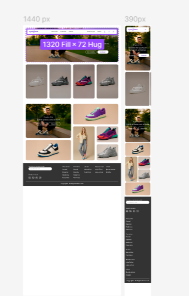

# SyntaxWear Ecommerce

SyntaxWear is an ecommerce website focused on sneakers and tennis shoes, offering a modern, responsive, and secure experience for users. The project was developed with HTML and CSS, prioritizing accessibility, performance, and best practices.

*  [Live Site URL](https://carlab09.github.io/ecommerce-syntaxwear/)

## Project Structure

```
├── index.html                # Main page of the site
├── .hintrc                   # webhint quality configuration
├── README.md                 # Project documentation
└── src/
	├── assets/
	│   ├── icons/            # SVG icons for navigation and social media
	│   └── images/
	│       ├── banners/      # Highlight images (hero)
	│       ├── products/     # Product images
	│       │   └── grid/     # Images for grid cards
	├── css/                  # Stylesheets
	│   ├── base.css          # Base styles
	│   ├── footer.css        # Footer styles
	│   ├── header.css        # Header styles
	│   ├── hero.css          # Hero section styles
	│   ├── product-category.css # Category styles
	│   ├── product-grid.css  # Product grid styles
	│   ├── reset.css         # Style reset
	│   └── variables.css     # CSS variables
```

## Features

- **Hero Section:** Visual highlight with centered image, slogan, and navigation buttons.
- **Categories:** Cards for navigating between shoe styles (Casual, Sport, Modern, Futuristic).
- **Product Grid:** Cards with images and buttons for gender selection.
- **Header:** Main navigation, responsive menu, and user, help, and cart icons.
- **Footer:** Quick links, newsletter form, and social media.

## Images and Icons
- Images are organized into banners, products, and grid.
- SVG icons for social media and navigation.

## Styles
- CSS modularized by section.
- Use of variables for easier maintenance.
- Style reset for consistency.

## Accessibility and Quality
- `.hintrc` configuration to ensure accessibility, security, and performance.
- Alternative text for images and icons.

## How to Run
1. Clone the repository.
2. Open the `index.html` file in your browser.
3. Styles and images are already organized in the `src` folder.

## Requirements
- Modern browser (Chrome, Firefox, Edge, Safari).
- No JavaScript or backend dependencies.

## Contribution
Pull requests are welcome. For suggestions or improvements, open an issue.

## License
Copyright. All Rights Reserved.

---

> Project developed for educational purposes and to demonstrate best practices in frontend ecommerce.


#### Figma image:

<br>